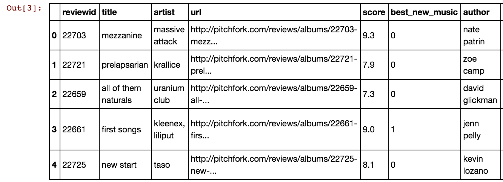

# Is Pitchfork Losing Its Edge?
An Analysis of Pitchfork Reviews Since Its 2015 Acquisition by Condé Nast & Pitchfork Review Recommendation System

# Background & Motivation

Pitchfork is an online music publication with a reputation for being opinionated, a little snobby, but usually right. Below is a satiric article published by the Onion that says it all:


In 2015, they were acquired by the large media company Conde Nast, leaving fans skeptical of the future of Pitchfork’s reputation. Here's an excerpt from a recent AMA that Pitchfork conducted on Reddit:


Do Pitchfork's more critical readers have any basis to claim that Pitchfork has become more 'vanilla' over time? 

I conducted statistical analysis on their **scoring methodology** and used natural language processing techniques on the **content of reviews** in search of evidence that **Pitchfork has measurably changed since they were acquired.**

# Data Collection

First, I scraped Pitchfork’s archives to gather over 19,000 reviews since 1999. I started with code from Nolan Conaway's GitHub, but had to make several adjustments to accomodate changes to Pitchfork's HTML and adding important features.




Reissues and older album reviews are not clearly marked on Pitchfork. I used RegEx to categorize any albums containing 'reissue', 'collector', 'box set' etc. as reviews that are not for the first release. Pitchfork tends to score these albums higher, so they were removed from my dataset for the analysis of scores.


# Scoring Distribution

I broke down Pitchfork reviews into five major buckets:

1. Before the launch of Best New Music in 2003 
2. Before the launch of Pitchfork Music Festival in 2006 (the first time Pitchfork had an incentive to promote specific artists)
3. Before the major website redesign in 2011
4. Before the Conde Nast acquisition in 2015
5. After the acquisition


The spread of scores given to albums has tightened with each major event.

Next, I evaluated if Pitchfork is still willing to gamble on new artists. In 2004, they gave Arcade Fire a 9.7 for their first release, putting them on the map:


But, since then, they have only given an album a 9.0 or above 8 times when the artist is being reviewed for the first time… and zero times since 2010.


# Natural Language Processing

I used SpaCy to tag all 14 million words from reviews with their part of speech, counting up the words that are most likely to be descriptive (adjectives, adverbs and certain tenses of verbs). I then used TextBlob to get a subjectivity score for each review, measuring how opinionated or objective the author was. 


I found that since 2003, Pitchfork reviews are getting less descriptive. The boxplots have notches indicating a 95% confidence interval of the median, showing that these changes are statistically significant. I also found that, while the content of the reviews has become more objective, the one-to-two sentence abstract at the top of the review has become more subjective. The subjectivity of the content and the abstract are converging together, giving the reader a more consistent account of Pitchfork’s opinion.


# Summary

Has Pitchfork changed its scoring methodology and review content since its acquisition? Yes:

- The spread of the score distribution has tightened
- Pitchfork doesn’t gamble big on new artists
- Pitchfork’s language has become less descriptive and more objective
- Pitchfork has become more consistent in the Abstract 

# Pitchfork Review Recommendation System:

Since my initial question had a pretty straightforward answer, I wanted to take things a step further to leverage Pitchfork's writing to make Pitchfork an even better tool for discovering music. So, I built a Pitchfork Review Recommendation System.

First, I needed to get more data. I used a wrapper from GitHub to access Spotify's API to get audio analysis for all tracks from the artists that Pitchfork has covered and took the mean for each album, ultimately matching with 11,600 albums on Pitchfork. The Spotify features I used were:

1. Danceability - a 0.0 to 1.0 score indicating how danceable a track is based on tempo, rhymthm stability, beat strength and overal regularity.
2. Energy - a 0.0 to 1.0 score measuring intensity and activity. Energetic tracks feel fast, loud and noisy
3. Valence - a 0.0 to 1.0 score measuring how positive a track sounds
4. Acousticness - a confidence measure from 0.0 to 1.0 of whether the track is acoustic.
5. Release Year - included since Pitchfork data only includes the year the review was published.


In building the content-content recommender in GraphLab, I used all of the features from Spotify, combined with TF-IDF vectors of each album review and Pitchfork's tagged genre as the basis for recommendations in GraphLab.

Since my recommender only need content data, I evaluated it using domain knowledge and just by listening to the recommendations it made for a few hours over the weekend. 


# Running the Recommender on Your Own Machine

Until I'm able to host the recommender, you can perform the following steps to use the recommender on your own.

System Requirements:
- GraphLab
- Python
- Flask

Run create_recommender.py. It'll take 10-15 minutes and ~200MB of disk space for GraphLab to train the recommenders. After tht is completed, run the .sh file in this repo using bash: ```bash run.sh```. You should be able to launch Flask in a browser.

# Future Work

I'd like to dive deeper into using Sentiment Analysis to model the relationship between the written text and the score given a review over time. I have anecdotally noticed that more frequently a review will read as a complete pan when it received a score of 6.0+. The challenge I encountered during the scope of this project was that sentiment polarity is much more difficult when the writing is at a high reading level, as Pitchfork uses more nuanced and literary writing styles than what TextBlob's models were trained on.

Currently, the recommender system only runs on my local machine (the GraphLab recommender objects are too large to push to GitHub). The Flask app is Heroku-ready except that Heroku is unable to install GraphLab upon launch.

# Technology Stack

Data Collection / Visualization:
- Python
- BeautifulSoup
- pandas/numpy
- matplotlib/seaborn

Natural Language Processing:
- spaCy
- TextBlob
- scikit-learn

Spotify Data:
- R

Pitchfork Review Recommender:
- GraphLab
- Flask


# Acknowledgments

Starter code for my webscraper:
https://github.com/nolanbconaway/pitchfork-data

Github repo used to get Spotify data into R:
https://github.com/charlie86/spotifyr


